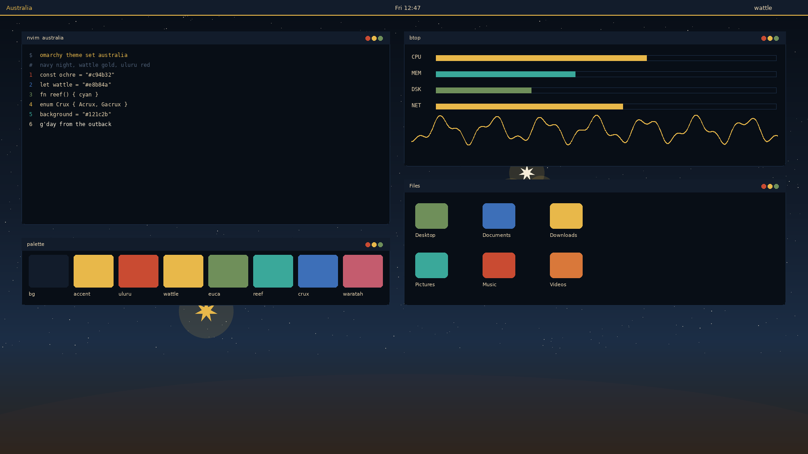
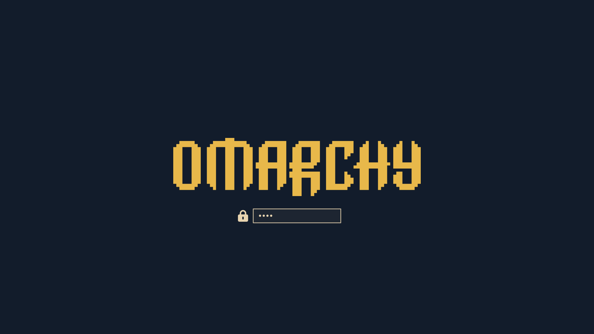

# Australia

An [Omarchy](https://omarchy.org) theme: navy Southern Cross night, golden wattle, and Uluru ochre.

Install name is `australia` because the repo follows `omarchy-[themename]-theme`.

## Install

```bash
omarchy theme install https://github.com/FarzadHayat/omarchy-australia-theme
```

Or in the Omarchy menu: Install > Style > Theme, then paste that URL.

## Palette

| Role | Hex | From |
|------|-----|------|
| Background | `#121c2b` | Flag navy / outback night |
| Foreground | `#e8d4b0` | Desert bone |
| Accent | `#e8b84a` | Golden wattle |
| Red | `#c94b32` | Uluru ochre |
| Green | `#6f8f5a` | Eucalyptus |
| Cyan | `#3aa89a` | Reef |
| Blue | `#3d6fb8` | Southern Cross |

`colors.toml` is the source of truth. Omarchy generates terminals, Hyprland, Neovim, VS Code, Helix, btop, Chromium, and the shell from it.

Icons use `Yaru-yellow`. Active window borders run gold into ochre.

## Backgrounds

- `omarchy.webp` wordmark
- `1-southern-cross.webp`
- `2-uluru.webp`
- `3-reef.webp`

Cycle with Super + Ctrl + Space.

## Preview



Unlock:


